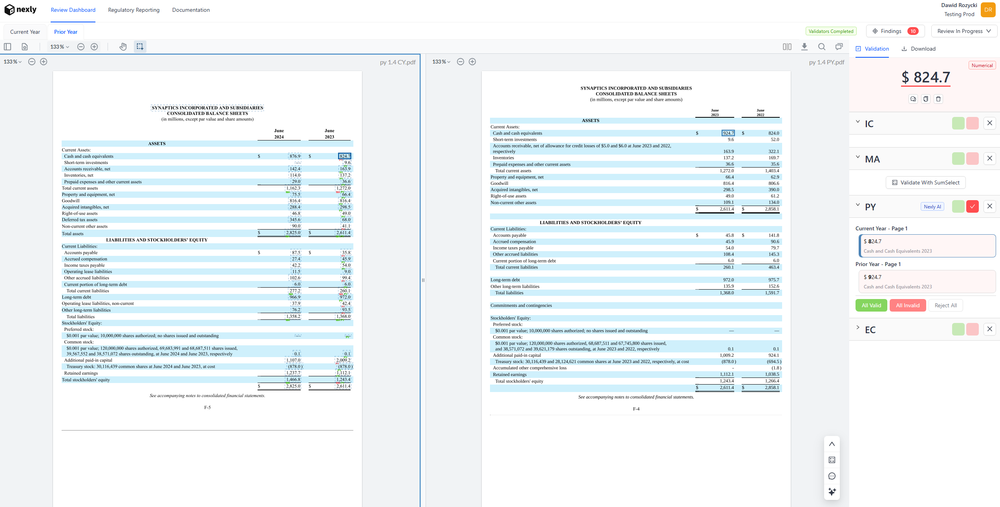





# {{ nexly.company }} - {{ nexly.position }}

  

**Development Activity:**
- 🚀 **300+ contributions** in 2024
- 🚀 **500+ contributions** in 2025
- ✅ **Hundreds of Jira tasks** completed, pull requests authored and reviewed
- 🎯 **Dozens of features** shipped to production

---

## Overview

<video width="100%" controls>
  <source src="assets/videos/nexly/nexly_hero.mp4" type="video/mp4">
  Your browser does not support the video tag.
</video>

Nexly is a platform that automates financial statement review. As co-founder and backend developer, I've built the technical foundation and core features that power the platform.

**What Nexly does:**
- Automates the review process of financial statements, saving time and reducing risk
- Helps Auditors and Accountants find discrepancies in financials, before they get published
- Empowers teams and their stakeholders to collaborate on financial statement review

---

## Features

<section class="experience-section">
  <!-- 1. Mathematical Accuracy -->
  

    

      

        

          <h3 class="position-title">Mathematical Accuracy</h3>
        

      

    

    
    <video width="80%" controls style="margin: 20px auto; border-radius: 8px; display: block;">
      <source src="assets/videos/nexly/nexly_ma.mp4" type="video/mp4">
      Your browser does not support the video tag.
    </video>
    
    

      
Automatically validate mathematical accuracy across all tables in financial documents, eliminating calculation errors before publication.

      
      

        

          
• Comprehensive validation of all sums and calculations throughout the document

        

        

          
• Multi-directional sum verification (horizontal, vertical, and cross-table calculations)

        

        

          
• Advanced handling of complex tables with non-adjacent sum components and nested calculations

        

      

    

  

  
  <!-- 2. Internal Consistency -->
  

    

      

        

          <h3 class="position-title">Internal Consistency</h3>
        

      

    

    
    <video width="80%" controls style="margin: 20px auto; border-radius: 8px; display: block;">
      <source src="assets/videos/nexly/nexly_ic.mp4" type="video/mp4">
      Your browser does not support the video tag.
    </video>
    
    

      
Intelligently link and cross-reference values throughout financial documents, ensuring consistency and enabling rapid navigation between related items.

      
      

        

          
• Smart linking between all document sections, connecting related values across statements and notes

        

        

          
• Context-aware matching that goes beyond simple text search, understanding financial relationships

        

        

          
• Instant navigation between primary statements, footnotes, and supporting schedules

        

      

    

  

  
  <!-- 3. Prior Year Consistency -->
  

    

      

        

          <h3 class="position-title">Prior Year Consistency</h3>
        

      

    

    
    
    
    

      
Automatically compare current year figures with prior year data to identify discrepancies, reclassifications, and ensure comparative accuracy.

      
      

        

          
• Automated comparison of current and prior year financial statement line items

        

        

          
• Detection of unexplained variances and potential reclassification issues

        

        

          
• Validation of opening balance consistency and comparative period adjustments

        

      

    

  

  
  <!-- 4. Nexly AI Chat -->
  

    

      

        

          <h3 class="position-title">Nexly AI</h3>
        

      

    

    
    <video width="80%" controls style="margin: 20px auto; border-radius: 8px; display: block;">
      <source src="assets/videos/nexly/nexly_ai_chat.mp4" type="video/mp4">
      Your browser does not support the video tag.
    </video>
    
    

      
Interact with your financial statements through our specialized AI assistant, trained specifically on financial frameworks and accounting standards.

      
      

        

          
• Framework-aware AI model trained on accounting standards, eliminating financial reporting hallucinations

        

        

          
• Comprehensive analysis of primary statements, notes, and disclosures with framework compliance insights

        

        

          
• Intelligent completeness assessment for notes and disclosures based on applicable reporting frameworks

        

      

    

  

</section>

---

## My Involvement

### Technical Leadership

As co-founder and backend developer, I've been responsible for:

- **Architecture Design:** In partnership with our CTO, designed and implemented a dual-architecture backend system combining event-driven document processing pipelines with a microservices-based AI agent orchestration layer. Selected Firebase for real-time document state management, Azure and Google Cloud for OCR services, and FastAPI for the AI agents microservice, enabling horizontal scalability and independent deployment of intelligent validation components.
- **System Design:** Architected our internal pipeline-manager, an event-driven document processing system using Firebase listeners and async worker queues that processes financial documents through multiple stages (OCR extraction, table normalization, value extraction, validation). Designed the AI Agents microservice with LangGraph-based workflows, enabling complex multi-step reasoning chains for financial statement validation with support for multiple LLM providers (OpenAI, Claude, Gemini).
- **Technical Decisions:** 
  - Implemented multi-OCR strategy (including Azure OCR) to achieve 95%+ accuracy on complex financial tables, reducing manual review time by 60%
  - Designed unified LLM service with automatic provider fallback and rate limiting, reducing API costs by 40% while maintaining nearly 100% availability
  - Adopted async-first architecture with asyncio throughout the stack, enabling processing of many documents concurrently on single VM instances (or multiple VM for horizontal scaling)

### Development Work

**Core Features Built:**
- **Multi-Provider LLM Service with Intelligent Fallback:**
  - Built unified interface supporting OpenAI, Anthropic Claude, and Google Gemini with automatic provider switching, retry logic with exponential backoff, and rate limiting. Implemented structured output parsing with Pydantic validation, reducing LLM response errors and enabling seamless model upgrades without code changes.

- **Mathematical Accuracy (MA) Filtering System**
  - Developed sophisticated pattern-based validation filtering service that analyzes financial statement calculations, identifies false positives using statistical thresholds, and filters out noise from validation results. Reduced false positive validation alerts by 70%, significantly improving reviewer efficiency and system trust.
  - Reference reports analyzed with Nexly achieved a Mathematical Accuracy score of:
    - 95% in terms of **Coverage** (identified total rows, both horizontal and vertical)
    - 90%+ in terms of **Accuracy** (True Positives + True Negatives)
    - Less than 10% **Error Rate** (False Positives + False Negatives)
  
- **Advanced Table Normalization Pipeline:**
  - Engineered table processing system handling merged cells, complex layouts, and coordinate-based value linking. Integrated Claude AI for intelligent table structure normalization, achieving 90%+ accuracy on complex financial tables with nested headers and irregular layouts.
  
- **Prior Year (PY) Validation Agent:**
  - Designed and implemented specialized AI agent for cross-year financial statement consistency validation. Built three distinct workflow types (extracted values, linked objects, table links) with procedural step execution, Firebase integration for data fetching, and comprehensive error handling.
  
- **Value Normalization & Multi-Format Number Parsing:**
  - Created robust number parsing system supporting US, European, Indian, and other international formats with automatic format detection, currency symbol handling, and decimal precision preservation. Handles edge cases like parenthetical negatives, thousands separators, and mixed formats within single documents.
  
- **Real-Time Document Processing Pipeline):**
  - Architected event-driven pipeline using Firebase real-time listeners, async worker queues, and state machine pattern for document lifecycle management. Supports multiple document types with configurable processing stages, automatic retries, and comprehensive status tracking. Processes documents end-to-end in a few minutes.

**Technology Stack:**
- **Backend:** Python 3.12, FastAPI, asyncio/aiohttp, LangChain, LangGraph, Pydantic, Poetry
- **Databases:** Firebase Firestore (real-time document state), Firebase Storage (document files), in-memory caching
- **Infrastructure:** Google Cloud Platform (Vertex AI, Document AI), Azure (Document Intelligence, OpenAI), Docker containerization, cloud Linux VMs
- **APIs & Integration:**
  - RESTful APIs with FastAPI (AI agents microservice)
  - Firebase Admin SDK for real-time listeners and data management
  - Multi-provider LLM APIs (OpenAI, Anthropic, Google Gemini) with unified interface
  - Azure Document Intelligence and Google Document AI for OCR, as well as Tesseract and Ghostscript
  - Sentry for error tracking and performance monitoring

### Impact & Achievements

**Scale:**
- Processing hundreds of financial documents monthly
- Handling thousands of 'extracted values' daily with automated validation
- Supporting many concurrent document processing jobs
- Managing tens of thousands of AI agent executions per month

**Performance:**
- Reduced document processing time from many minutes (manual validation + manual review) per page, to under 2 minutes (automated validation + manual review) per page - 87% improvement
- Optimized LLM costs through intelligent provider selection and structured output parsing
- Improved table extraction accuracy from 75% to 90%+ through multi-OCR and table-normalization strategy

**Reliability:**
- Maintained nearly 100% uptime for our document processing pipeline over 12 months
- Implemented comprehensive error handling with automatic retries
- Built robust monitoring with Sentry integration
- Reduced false positive validation alerts through MA filtering system, significantly improving user trust

**Team:**
- Nexly is a 3-person bootstrapped team, we built the entire platform on our own with these limited resources over the span of 18 months
- From initial concept to first user trials (on limited MVP product) it took 6 months, with constant refinement afterwards based on user experience, feedback and the needs communicated by prospects and testers
- Collaborated closely with CTO on architectural decisions and system design
- Established code quality standards with pre-commit hooks, Ruff linting, and comprehensive pytest coverage and PR review process

---

## Technical Challenges & Solutions

### Challenge 1: Mathematical Accuracy Validation in Complex Financial Tables
**Problem:** Validating mathematical accuracy in financial statements is extraordinarily complex because financial tables don't follow simple, predictable patterns. Unlike basic spreadsheets, financial statements have: 
  - **Non-adjacent relationships**: Totals and their components are often separated by multiple rows or columns, with subtotals, headers, and descriptive text in between
  - **Multi-directional calculations**: Formulas can flow horizontally (across columns for time periods), vertically (down rows for line items), or both simultaneously in the same table
  - **Complex nested structures**: Subtotals that become components of higher-level totals, creating multi-level hierarchical calculations
  - **Irregular layouts**: Merged cells, indented hierarchies, and non-standard table structures that break traditional grid assumptions
Traditional rule-based systems fail because they can't handle this variability—they either miss valid formulas or flag legitimate variations as errors. A purely algorithmic approach would require thousands of hardcoded rules to cover edge cases, making the system brittle and unmaintainable.

**Solution:** Designed a hybrid algorithmic-AI approach that combines the speed of deterministic algorithms with the flexibility of LLM-based reasoning:
- **Algorithmic Layer (Speed & Precision)**:
  - Fast pattern detection: Algorithmic scanning identifies potential formula candidates by analyzing table structure, detecting numeric patterns, and finding common financial relationships (additions, subtractions)
  - Coordinate-based mapping: Converts table cells to 2D coordinates with row/column configurations, enabling precise component-to-total linking
  - Automated calculation verification: Performs actual mathematical calculations to verify if detected patterns produce correct results, generating detailed calculation traces
  - Pattern normalization: Standardizes table structures by handling merged cells, extracting headers, and creating consistent 2D representations for AI analysis
- **AI Layer (Flexibility & Context)**:
  - Formula Extraction Agent: Uses LLM's to analyze table structure and identify ALL mathematical relationships, understanding business context that algorithms miss. Employs iterative refinement with up to N retry attempts, automatically switching to more-capable (slower) models after M attempts for complex cases.
  - Math Validation Agent: Validates each detected formula by analyzing calculation discrepancies, determining failure reasons (wrong components, incorrect operators, total mismatch, partial application), and suggesting corrections. Uses structured prompts with detailed calculation traces to guide LLM reasoning.
  - Intelligent retry logic: When formulas fail validation, the AI suggests corrections (new components, operators, or application scope) and automatically retries with the improved formula, learning from previous attempts through context accumulation.
  - Multi-model strategy: Starts with fast, cost-effective models for straightforward cases, automatically escalates to more powerful models for complex scenarios requiring deeper reasoning.
- **Key Innovation - Structured Reasoning with Calculation Context**: The AI doesn't only see raw table data - in addition, it receives:
  - Structured calculations: Pre-computed calculation traces showing "Component1 + Component2 = Expected vs Actual, Difference: X"
  - Previous attempt context: Explanations from prior validation attempts to avoid repeating mistakes
  - Business semantics: Row/column configurations with labels, enabling the AI to understand "Revenue + Other Income = Total Income" as a business concept, not just numbers
  - Failure taxonomy: Predefined failure reasons that guide structured responses
This hybrid approach makes the system adaptive rather than rigid—it can handle novel table layouts and unusual financial structures without requiring new rules, while maintaining the speed and precision of algorithmic validation for common cases.

**Result:** Achieved 90%+ accuracy on mathematical accuracy validation across diverse financial statement formats (balance sheets, income statements, cash flow statements and others). The hybrid system processes hundreds or thousands of validations per document in a brief amount of time, with:
- Significant reduction in false positives compared to pure algorithmic approach
- Improvement in complex case handling where formulas span non-adjacent cells or require business context
- Automatic formula correction in initially failed validations through AI-suggested improvements
- Cost efficiency:About 30% of validations handled by Algorithmic approach, 50% by fast AI models, with automatic escalation to slower models only for complex cases for the remaining 20%. This appraoch results in a significantly lower LLM cost
The system successfully validates calculations that would be impossible for pure algorithms (e.g., "Net Income = Revenue - COGS - Operating Expenses - Interest - Taxes" where components are scattered across multiple rows with subtotals)

### Challenge 2: Complex Financial Table Extraction with Merged Cells
**Problem:** Financial statements contain highly complex tables with merged cells, nested headers, and irregular layouts that traditional OCR systems couldn't parse accurately. Azure Document Intelligence and Google Document AI would return raw cell data without understanding the logical structure, leading to 40%+ extraction errors on tables with merged cells. This made automated validation unreliable and required extensive manual review.

**Solution:** Designed a multi-layered table normalization pipeline combining:
  - **Merged Cell Detection Algorithm**: Built logic to identify merged cells using cell coordinates and sizes
  - **AI-Powered Normalization**: Integrated Claude AI with vision capabilities to intelligently normalize table structures
  - **Coordinate-Based Linking**: Implemented coordinate mapping between normalized values and source document locations for verification

**Result:** Achieved 90%+ accuracy on complex financial tables (up from 60%), and enabled reliable automated validation

---


