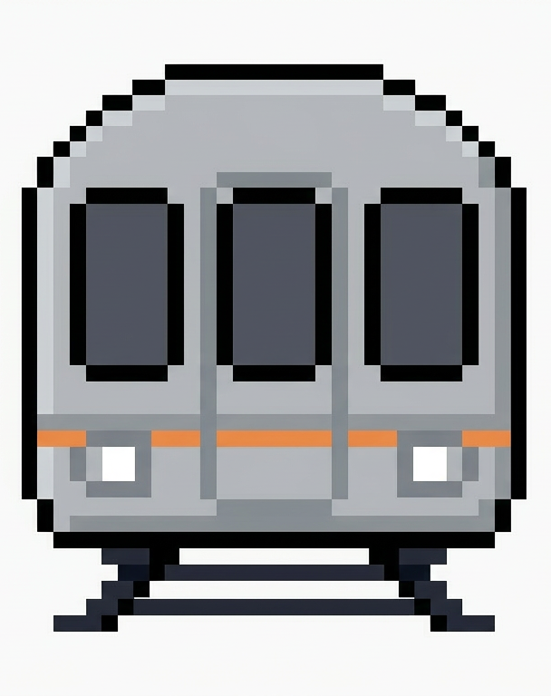
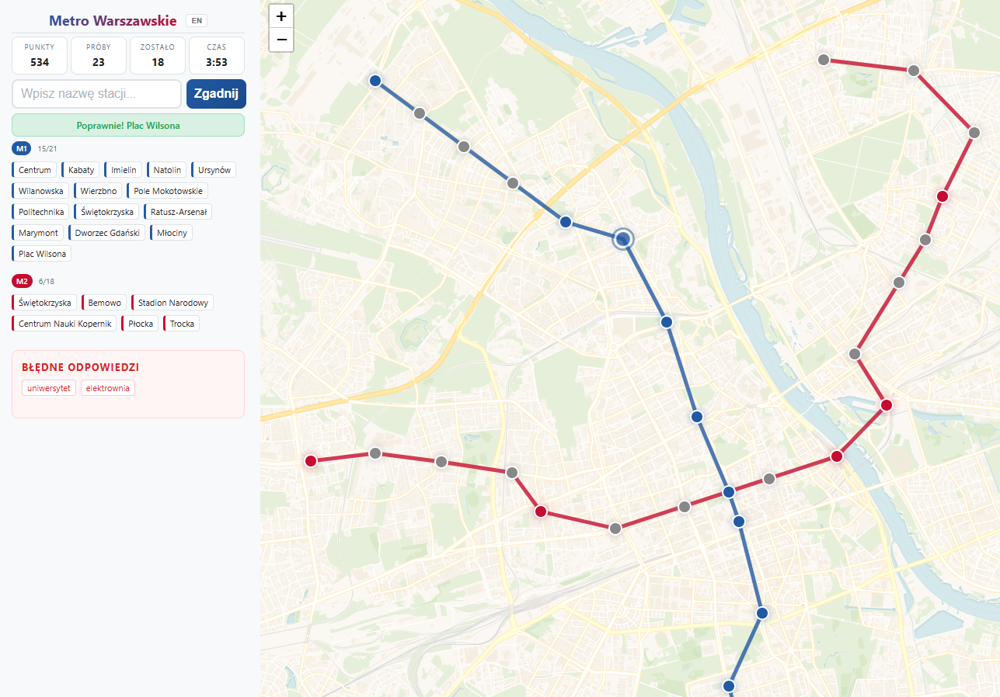
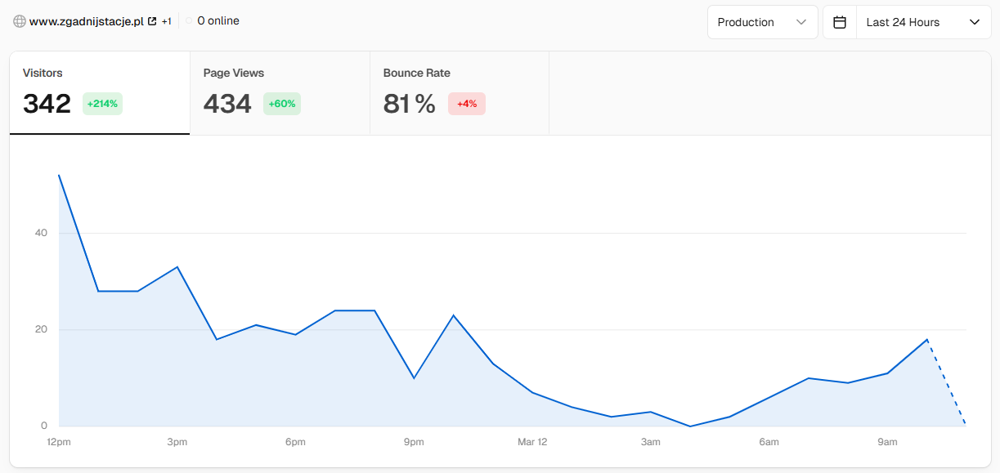



  

  <h1>Metro Warszawskie</h1>
  
A Warsaw Metro Station Guessing Game

## Overview

Metro Warszawskie is an interactive web game that challenges players to guess all 38 Warsaw Metro stations across two lines (M1 and M2) as quickly as possible.

**Current Status:** Live 🚀  
**Website:** [https://zgadnijstacje.pl](https://zgadnijstacje.pl)

---

## Gameplay

  <h3>Game Screenshot</h3>
  
  
Interactive map-based station guessing gameplay

  <h3>Engagement & Celebration</h3>
  
  
Confetti celebration and score sharing on game completion

---

## The Problem

Learning Warsaw's metro system can be challenging for both locals and visitors. There's no engaging, interactive way to familiarize yourself with all station names and their locations.

**Key challenges:**
- Memorizing 38 station names across two metro lines is difficult
- Traditional maps don't provide interactive learning
- No gamified way to test your knowledge
- Limited engagement for casual learners

---

## The Solution

Metro Warszawskie transforms metro learning into an engaging game where players type station names to find them on an interactive map. The game combines fuzzy matching, bilingual support, and real-time feedback to make learning fun and rewarding.

**Core value propositions:**
- Interactive map-based gameplay with real-time station discovery
- Fuzzy matching with Polish character normalization for forgiving input
- Bilingual support (Polish/English) for diverse audiences
- Score system that rewards speed and accuracy
- Social sharing capabilities to challenge friends

---

## Features

<section class="experience-section">
  <!-- 1. Interactive Map Gameplay -->
  

    

      

        

          <h3 class="position-title">Interactive Map Gameplay</h3>
          
Real-time visualization of discovered stations on an OpenStreetMap-based interface

        

      

    

    
    

      
Real-time visualization of discovered stations on an OpenStreetMap-based interface powered by Leaflet.

      
      

        

          
• Visual feedback as you discover each station

          
• See station locations on an accurate Warsaw metro map

          
• Track progress across M1 and M2 lines

        

      

    

  

  
  <!-- 2. Fuzzy Matching with Polish Characters -->
  

    

      

        

          <h3 class="position-title">Fuzzy Matching with Polish Characters</h3>
          
Intelligent input matching that handles typos and Polish diacritical marks

        

      

    

    
    

      
Intelligent input matching that handles typos and Polish diacritical marks, making the game forgiving and accessible.

      
      

        

          
• Type "Swietokrzyska" and match "Świętokrzyska"

          
• Handles common typos and variations

          
• Normalizes Polish characters automatically

        

      

    

  

  
  <!-- 3. Bilingual Support -->
  

    

      

        

          <h3 class="position-title">Bilingual Support</h3>
          
Full Polish and English interface for international accessibility

        

      

    

    
    

      
Full Polish and English interface for international accessibility.

      
      

        

          
• Switch between Polish and English seamlessly

          
• Supports both language inputs for station names

          
• Accessible to locals and international visitors

        

      

    

  

  
  <!-- 4. Dynamic Scoring System -->
  

    

      

        

          <h3 class="position-title">Dynamic Scoring System</h3>
          
Score decreases over time, rewarding quick and accurate guessing

        

      

    

    
    

      
Score decreases over time, rewarding quick and accurate guessing.

      
      

        

          
• Compete for the fastest completion times

          
• Real-time score updates

          
• Encourages speed and accuracy

        

      

    

  

  
  <!-- 5. Social Sharing & Celebration -->
  

    

      

        

          <h3 class="position-title">Social Sharing & Celebration</h3>
          
Share your victory with confetti animations and social media integration

        

      

    

    
    

      
Share your victory with confetti animations and social media integration.

      
      

        

          
• Confetti celebration on game completion

          
• Share results on Twitter/X and Facebook

          
• Challenge friends to beat your score

        

      

    

  

</section>

---

## Technology Stack

**Frontend:**
- React 19 for modern UI and state management
- Vite for fast development and optimized builds
- Leaflet for interactive map visualization
- OpenStreetMap for accurate geographic data
- canvas-confetti for celebration animations

**Features:**
- Fuzzy matching algorithm with Polish character normalization
- Bilingual support (Polish/English)
- Cookie consent banner for privacy compliance
- Responsive design for desktop and mobile

**Analytics:**
- Cloudflare Web Analytics integration
- User behavior tracking and engagement metrics

**Other Tools:**
- Buy Me a Coffee integration for support
- Social media sharing (Twitter/X, Facebook)

---

## Game Mechanics

### How to Play
1. Click "Start" to begin the game
2. Type station names in the input field
3. Find all 38 stations (21 M1 + 18 M2, including interchange at Świętokrzyska)
4. Score decreases over time - guess quickly!
5. Celebrate your victory with confetti and share your score

### Station Coverage
- **M1 Line:** 21 stations
- **M2 Line:** 18 stations
- **Interchange:** Świętokrzyska (counted in both lines)
- **Total:** 38 unique stations

---

## Development Journey

### The Vision
Create an engaging, interactive way for people to learn and test their knowledge of Warsaw's metro system through gamification.

### Current Progress
The platform is live and fully functional with all core features implemented.

**Completed:**
- Interactive map-based gameplay with Leaflet/OpenStreetMap
- Fuzzy matching with Polish character normalization
- Bilingual interface (Polish/English)
- Dynamic scoring system with time-based penalties
- Social sharing capabilities (Twitter/X, Facebook)
- Confetti celebration animations
- Cookie consent banner
- Cloudflare Web Analytics integration
- Buy Me a Coffee support integration
- Responsive mobile design

**Planned:**
- Leaderboard system for competitive play
- Difficulty levels (easy, medium, hard)
- Time attack mode with different time limits
- Station information cards with historical details
- Offline mode support
- Progressive Web App (PWA) capabilities

---

## Technical Highlights

### Fuzzy Matching Implementation
Implemented a robust fuzzy matching algorithm that:
- Normalizes Polish diacritical marks (ą, ć, ę, ł, ń, ó, ś, ź, ż)
- Handles common typos and character variations
- Provides forgiving user experience without sacrificing accuracy
- Works seamlessly across both Polish and English inputs

### Map Integration
Leveraged Leaflet and OpenStreetMap to:
- Display accurate Warsaw metro station locations
- Provide real-time visual feedback as stations are discovered
- Support interactive exploration of the metro system
- Maintain responsive performance across devices

### Performance Optimization
- Vite-based build system for fast development and optimized production bundles
- Efficient state management for real-time score updates
- Optimized asset loading for quick game startup

---

## Get Involved

Try Metro Warszawskie and test your knowledge of Warsaw's metro system!

**Play now:** https://zgadnijstacje.pl  
**Join the community:** [Discord Server](https://discord.gg/EpmN8MDDNr)

---


